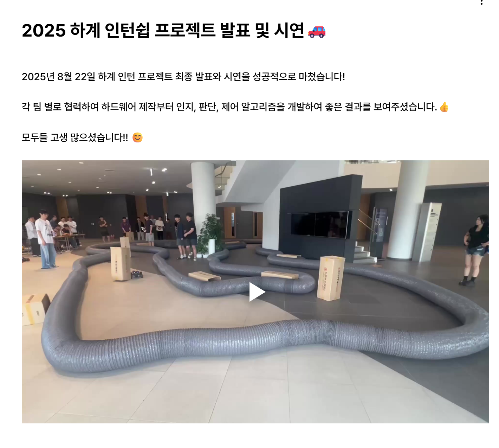
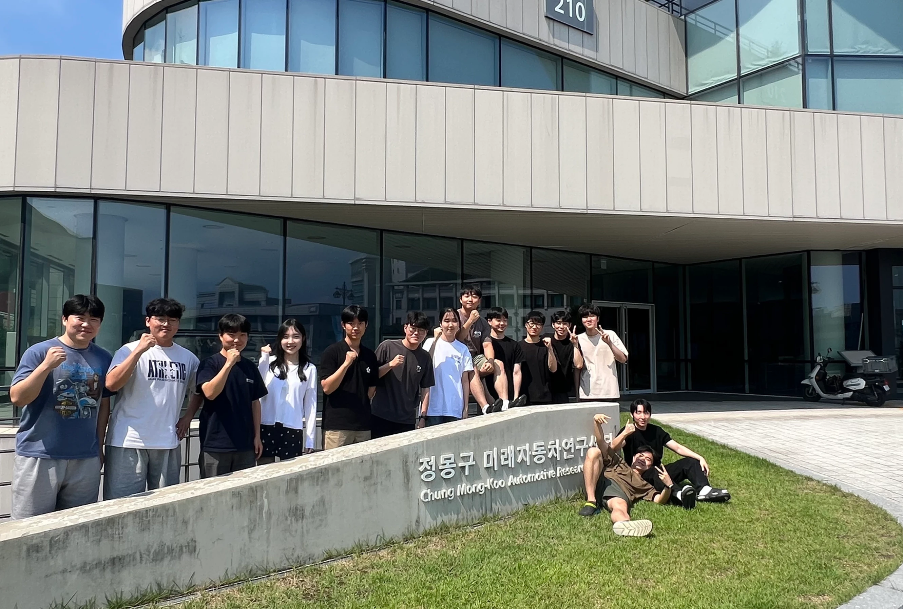

# 🏎️ 2025 Summer Internship — F1TENTH Autonomous Racing

> 2025 하계 인턴십 · Automotive Intelligence Laboratory / Chung Mong-Koo Future Automotive Research Center (Hanyang University)
> Final presentation & demo: **2025.08.22**

A summer internship project on **1/10-scale autonomous racing (F1TENTH)**. Each team built the platform end-to-end — from **hardware assembly** through **perception, decision-making, and control algorithms** — and completed a live demo run on an indoor track.

## 🎬 Demo Video

<video src="https://github.com/jongmyeongpark/Portfolio/raw/main/2025_Summer_Internship_F1TENTH/media/f1tenth_demo.mp4" controls muted width="720"></video>

▶️ If the player above doesn't load, click the thumbnail below to watch:

## 🏁 Final Demo & Track

> 2025년 8월 22일 하계 인턴 프로젝트 최종 발표와 시연을 성공적으로 마쳤습니다.
> 각 팀 별로 협력하여 하드웨어 제작부터 인지 · 판단 · 제어 알고리즘을 개발했습니다.

## 👥 Team

## 🔧 Scope

- **Hardware:** F1TENTH 1/10-scale vehicle assembly
- **Perception:** onboard sensing for track/obstacle recognition
- **Planning & Control:** autonomous lap driving on an indoor track
- **Outcome:** successful live demo at the final presentation (2025.08.22)
